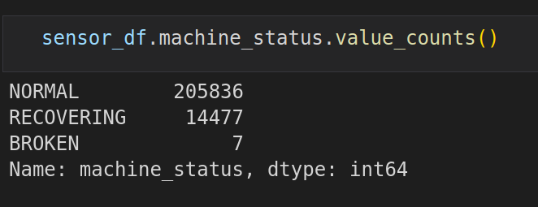

# ML_methods_for_anomaly_detection

Anomaly detection using K-Means, Isolation Forest, SVM and LOF.

# Dataset

In this project we will use dataset with sensor's measurements. One row contains measurements from 50 sensors, time when measurement was taken and machine status in that moment (NORMAL, BROKEN, RECOVERING). Data has 220320 rows and 55 columns.

First we need to clean the data.

Columns sensor 15 and unnamed is unnecessary so we will drop them.

Next let's calculate the percentage of missing values.

We can see that sensor 50 has too many missing values, so we will drop that.

After that we will convert our timestamp column to datetime and use it as index.

# Explorational Data Analysis

Let's take a look at distribution of machine status column in our data. We can see that the majority of our data is normal data and we have only 7 broken examples.

# Scaling Data and Dimensionality Reduction

First we want scale the data and reduce dimensionality of the data to pass it to our models. To do that we will use StandardScaler and PCA.

We will calculate PCA with 2 components according to importance of PCA components.

Let's also make autocorreleation plot.

# Model-1 - K-Means Clusting

We will use K-Means model to cluster our data. Then we will calculate the distances between every point and centroid of a cluster. After that we will choose a threshold. If distance is above that threshold we will mark it as anomaly.

Let's plot our clusters.

Next we need to calculate the distances and choose a threshold. We assume that 13% of the entire data set are anomalies. As the threshold we will take the minimum of the largest 13% of the distances.

Now we can plot K-Means anomalies.

# Model-2 - Isolation Forest
